<picture>
  <source media="(prefers-color-scheme: dark)" srcset="assets/hero-dark.svg">
  <source media="(prefers-color-scheme: light)" srcset="assets/hero-light.svg">
  
</picture>

<a href="mailto:manan305@icloud.com">
  <picture>
    <source media="(prefers-color-scheme: dark)" srcset="assets/link-email-dark.svg">
    
  </picture>
</a>
<a href="https://www.linkedin.com/in/manan305">
  <picture>
    <source media="(prefers-color-scheme: dark)" srcset="assets/link-linkedin-dark.svg">
    
  </picture>
</a>
<a href="https://github.com/mananpatelll?tab=repositories">
  <picture>
    <source media="(prefers-color-scheme: dark)" srcset="assets/link-github-dark.svg">
    
  </picture>
</a>

---

### `$ whoami`

I'm an AI engineer in Philadelphia. I build **agentic LLM systems** — the kind that have to
commit to a decision, show their reasoning, and stay measurable when they get it wrong.

Two questions take up most of my time:

1. How do you get several LLM agents to produce a decision a human would actually sign off on?
2. How do you tell whether that decision-making is any good, without waiting on a signal as
   noisy as short-run P&L?

The background behind it is an unusual mix that turns out to work well together: an M.S. in
Computer Science, a year of NIH-funded clinical machine learning research, and real time in
markets — an equity research desk, plus my own options and equities trading.

---

<picture>
  <source media="(prefers-color-scheme: dark)" srcset="assets/pipeline-dark.svg">
  <source media="(prefers-color-scheme: light)" srcset="assets/pipeline-light.svg">
  
</picture>

**What that diagram is actually arguing:**

- **LLMs propose, code disposes.** Position sizing, reward-to-risk floors, stop placement and
  trade caps live in a deterministic gate the model has no way to argue its way past.
- **Keep deterministic work deterministic.** Screening 500 tickers for liquidity and setup
  quality is a rules problem — cheaper, faster and auditable. Agents are reserved for the
  places where judgment genuinely helps.
- **Evaluate the process, not the outcome.** One trade tells you almost nothing. Groundedness,
  policy compliance and safety invariants can be measured on every single run.
- **Show the reasoning before anything happens.** A LangGraph interrupt puts the full agent
  rationale in front of a human ahead of execution.
- **`NO-TRADE` is a first-class answer.** A system that can't decline isn't managing risk,
  it's generating volume.

---

<picture>
  <source media="(prefers-color-scheme: dark)" srcset="assets/stack-dark.svg">
  <source media="(prefers-color-scheme: light)" srcset="assets/stack-light.svg">
  
</picture>

---

<picture>
  <source media="(prefers-color-scheme: dark)" srcset="assets/metrics-dark.svg">
  <source media="(prefers-color-scheme: light)" srcset="assets/metrics-light.svg">
  
</picture>

Every number there comes out of a seeded, reproducible run or a peer-reviewed clinical
pipeline. The two I find most interesting are the failure modes: a **48% tool-bypass rate**
and a **40-point accuracy gap** between ungrounded and tool-grounded answers only showed up
because the ablations were controlled — an unmeasured agent would have looked fine.

---

### `$ history`

<table>
<tr>
  <td><code>2025&nbsp;→</code></td>
  <td><b>Independent AI engineer</b> — agentic systems &amp; LLM evaluation</td>
</tr>
<tr>
  <td><code>2025</code></td>
  <td><b>Research lead</b> — undergraduate capstone team, Civic Interactions Lab.
      Set direction and acted as stakeholder for the students who built it.</td>
</tr>
<tr>
  <td><code>2024&nbsp;–&nbsp;25</code></td>
  <td><b>ML research assistant, clinical AI</b> — Temple University, Center for
      Dental Informatics &amp; AI · NIH-funded (U01, NIDCR)</td>
</tr>
<tr>
  <td><code>2023</code></td>
  <td><b>Technical analyst intern, equities</b> — Arihant Investments, Vadodara</td>
</tr>
</table>

**M.S. Computer Science**, Temple University (2024 – 25) · **B.C.A.**, Charotar University of Science and Technology (2020 – 23)

---

### `$ ls publications/`

- **AI-Driven Application for Feature Reduction in Linked EHR** — abstract, 2025 AADOCR/CADR
  Annual Meeting, New York, NY. *Co-author*
- **Developing Deep Learning Models to Improve Dental Radiograph Clarity and Quality** —
  abstract, 2025 IADR/PER General Session, Barcelona, Spain. *Co-author*
- **Periodontitis prediction model with linked electronic health records** — *JDR Clinical &
  Translational Research*, 2025. *Programming contributor*
- **Orthodontic NLP model for automated clinical note information extraction** — *Orthodontics
  & Craniofacial Research*, 2024. [`10.1111/ocr.12944`](https://doi.org/10.1111/ocr.12944)
  *Programming contributor*

---

**Currently open to AI engineering roles.**
Agentic systems, LLM evaluation, applied ML — especially anywhere near markets.

Every graphic on this page is a hand-authored SVG generated by
<a href="assets/src/build.py"><code>assets/src/build.py</code></a> — no badge services, no
external fonts, no runtime requests.

