<picture>
  <source media="(prefers-color-scheme: dark)" srcset="assets/hero-dark.svg">
  <source media="(prefers-color-scheme: light)" srcset="assets/hero-light.svg">
  
</picture>

<a href="mailto:manan305@icloud.com">
  <picture>
    <source media="(prefers-color-scheme: dark)" srcset="assets/link-email-dark.svg">
    
  </picture>
</a>
<a href="https://www.linkedin.com/in/manan305">
  <picture>
    <source media="(prefers-color-scheme: dark)" srcset="assets/link-linkedin-dark.svg">
    
  </picture>
</a>
<a href="https://github.com/mananpatelll?tab=repositories">
  <picture>
    <source media="(prefers-color-scheme: dark)" srcset="assets/link-github-dark.svg">
    
  </picture>
</a>

---

### `$ whoami`

AI engineer in Philadelphia, mostly building agentic LLM systems.

Day to day that means LangGraph and multi-agent orchestration, retrieval and RAG,
and the evals that keep both honest — with Python, PyTorch and vector databases
underneath. Full stack further down.

Before that: a year of clinical ML research at Temple, and a summer on an equity
research desk.

<picture>
  <source media="(prefers-color-scheme: dark)" srcset="assets/projects-dark.svg">
  <source media="(prefers-color-scheme: light)" srcset="assets/projects-light.svg">
  
</picture>

<picture>
  <source media="(prefers-color-scheme: dark)" srcset="assets/pipeline-dark.svg">
  <source media="(prefers-color-scheme: light)" srcset="assets/pipeline-light.svg">
  
</picture>

The trading desk in diagram form. Three things I'd keep if I started it over:

- **The model doesn't get the last word.** Sizing, stops, R:R floors — plain code
  the LLM can't talk its way around.
- **Don't make an LLM do a for-loop.** Screening 500 tickers is a rules problem.
  Agents only where judgment actually helps.
- **`NO-TRADE` is a real answer.** Something that can't say no isn't managing risk.

---

<picture>
  <source media="(prefers-color-scheme: dark)" srcset="assets/timeline-dark.svg">
  <source media="(prefers-color-scheme: light)" srcset="assets/timeline-light.svg">
  
</picture>

<picture>
  <source media="(prefers-color-scheme: dark)" srcset="assets/stack-dark.svg">
  <source media="(prefers-color-scheme: light)" srcset="assets/stack-light.svg">
  
</picture>

### `$ ls publications/`

From the Temple research year — I wrote code on these, not prose.

- **AI-Driven Application for Feature Reduction in Linked EHR** — abstract, 2025
  AADOCR/CADR Annual Meeting, New York, NY. *Co-author*
- **Developing Deep Learning Models to Improve Dental Radiograph Clarity and
  Quality** — abstract, 2025 IADR/PER General Session, Barcelona, Spain.
  *Co-author*
- **Periodontitis prediction model with linked electronic health records** —
  *JDR Clinical & Translational Research*, 2025. *Programming contributor*
- **Orthodontic NLP model for automated clinical note information extraction** —
  *Orthodontics & Craniofacial Research*, 2024.
  [`10.1111/ocr.12944`](https://doi.org/10.1111/ocr.12944)
  *Programming contributor*

---

**Open to AI engineering roles** — agentic systems, LLM evaluation, applied ML.
Happy to talk about any of it.

Every graphic here is a hand-rolled SVG built by
<a href="assets/src/build.py"><code>assets/src/build.py</code></a> — no badge
services, no external fonts, no runtime requests, no JavaScript. Motion is SMIL
and CSS keyframes, which is all that runs inside GitHub's image sandbox.

